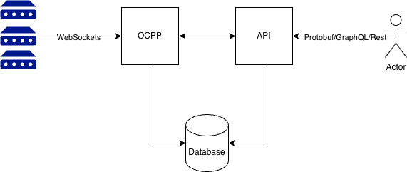

# Introduction

## What is this?

OCPP CSMS Server is a server for OCPP CSMS implementing both ocpp 1.6 and 2.0. It acts as an in between the chargers
and the rest of your system. This offloads the complexity of websockets state management etc. And instead you are left
with a clean, Protobuf, GraphQL, or Rest API to use.

## What it is not?

OCPP CSMS Server is not an authentication server, or payment solution. It simply takes care of the interaction with the
chargers. While it does implement secure features for connecting with the chargers, it is still up to the user to
implement a way to decide which chargers are allowed to connect.

## Why?

Implementing a fully functional and scalable OCPP CSMS is not trivial. It requires a deep understanding of the OCPP
specifications, as well as experience with websockets, GraphQL, and REST APIs. Additionally, it requires careful
consideration of security, scalability, and performance, which can be challenging to get right. There is currently a
lack of this in the market, and this project aims to fill this void.

## Architecture

OCPP CSMS Server is a system consisting of 3 main components:

- OCPP: Responsible for connecting with the chargers
- API: Allows other systems to interact with the OCPP CSMS Server
- Database: Stores information about chargers, transactions, and other relevant data

Everything is built using Rust and Dockerized.